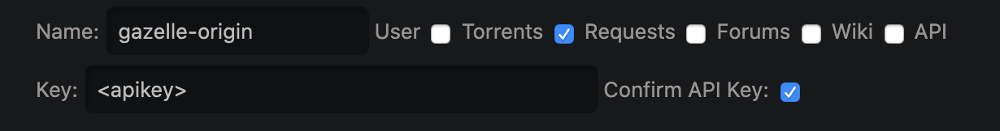
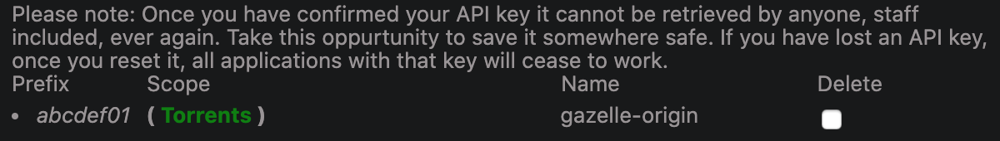

gazelle-origin (plus)
==============

`gazelle-origin` is a script that fetches and saves YAML torrent origin information from Gazelle-based music trackers. 

This is a fork of x1ppy's work that adds a significant amount of meta data to the yaml file including tags (thanks to RollingStar's fork), artists (organized by type), release type, orginal label and cat # (for those releases that were never updated), the cover art URL and the group decription. More could be added easily.

Example output from `gazelle-origin` (plus):

~~~
Artist:                  Kendrick Lamar
Name:                    Mr. Morale & The Big Steppers
Release type:            Album
Record label:            pgLang / Top Dawg Entertainment / Aftermath / Interscope Records
Catalog number:          '602445924035'
Edition year:            2022
Edition:                 ~
Tags:                    hip.hop
Main artists:            Kendrick Lamar
Featured artists:        Amanda Reifer, Baby Keem, Beth Gibbons, Blxst, Ghostface Killah, Kodak Black, Sam Dew, Sampha, Summer Walker, Tanna Leone, Taylour Paige
Producers:               Baby Keem, Beach Noise, Bekon, BGK, Boi-1da, DJ Dahi, DJ Kahlil, Duval Timothy, FnZ, Grandmaster Vic, J.LBS, Jahaan Sweet, Pharrell Williams, Sounwave, Tae Beast, The Alchemist, Tim Maxey
Remix artists:           ~
DJs:                     ~
Composers:               ~
Conductors:              ~
Original year:           2022
Original release label:  ~
Original catalog number: ~
Media:                   WEB
Log:                     ~
Format:                  FLAC
Encoding:                24bit Lossless
Directory:               Kendrick Lamar - Mr. Morale & The Big Steppers (2022) - WEB FLAC 24-48
Size:                    880205823
File count:              19
Info hash:               464E935F643E4E04FF2D78B547F0C1CCBA9FFF57
Uploaded:                2022-05-17 12:28:05
Permalink:               https://redacted.ch/torrents.php?torrentid=3688481
Cover:                   https://ptpimg.me/y7qu51.jpg

Comment: |-
  24/48

  This upload is NOT watermarked.
  This release corrects the missing audio (not) present at the beginning of track 1-07 in the previous torrent.

Files:
- Name: 1-01. United In Grief.flac
  Size: 50174237
- Name: 1-02. N95.flac
  Size: 40566393
- Name: 1-03. Worldwide Steppers.flac
  Size: 39116982
- Name: 1-04. Die Hard (feat. Blxst & Amanda Reifer).flac
  Size: 50003947
- Name: 1-05. Father Time (feat. Sampha).flac
  Size: 47215176
- Name: 1-06. Rich (Interlude).flac
  Size: 19379202
- Name: 1-07. Rich Spirit.flac
  Size: 41482864
- Name: 1-08. We Cry Together (feat. Taylour Paige).flac
  Size: 70349111
- Name: 1-09. Purple Hearts (feat. Summer Walker & Ghostface Killah).flac
  Size: 68380675
- Name: 2-01. Count Me Out.flac
  Size: 57896003
- Name: 2-02. Crown.flac
  Size: 50667334
- Name: 2-03. Silent Hill (feat. Kodak Black).flac
  Size: 43863990
- Name: 2-04. Savior (Interlude).flac
  Size: 29382784
- Name: 2-05. Savior (feat. Baby Keem & Sam Dew).flac
  Size: 46391345
- Name: 2-06. Auntie Diaries.flac
  Size: 53195084
- Name: 2-07. Mr. Morale (feat. Tanna Leone).flac
  Size: 42007387
- Name: 2-08. Mother I Sober (feat. Beth Gibbons).flac
  Size: 74502754
- Name: 2-09. Mirror.flac
  Size: 53147454
- Name: cover.jpg
  Size: 2483101

Description: |-
  [b][artist]Kendrick Lamar[/artist] - Mr. Morale & The Big Steppers[/b]
  May 13, 2022

  [b]Disc 1 - Big Steppers[/b]
  [b]1.[/b] United In Grief [i](04:15)[/i]
  [b]2.[/b] [url=https://www.youtube.com/watch?v=zI383uEwA6Q]N95[/url] [i](03:15)[/i]
  [b]3.[/b] Worldwide Steppers [i](03:23)[/i]
  [b]4.[/b] Die Hard (feat. [artist]Blxst[/artist] & [artist]Amanda Reifer[/artist]) [i](03:59)[/i]
  [b]5.[/b] Father Time (feat. [artist]Sampha[/artist]) [i](03:42)[/i]
  [b]6.[/b] Rich (Interlude) [i](01:43)[/i]
  [b]7.[/b] Rich Spirit [i](03:22)[/i]
  [b]8.[/b] We Cry Together (feat. [artist]Taylour Paige[/artist]) [i](05:41)[/i]
  [b]9.[/b] Purple Hearts (feat. [artist]Summer Walker[/artist] & [artist]Ghostface Killah[/artist]) [i](05:29)[/i]
  
  [b]Disc 2 - Mr. Morale[/b]
  [b]1.[/b] Count Me Out [i](04:43)[/i]
  [b]2.[/b] Crown [i](04:24)[/i]
  [b]3.[/b] Silent Hill (feat. [artist]Kodak Black[/artist]) [i](03:40)[/i]
  [b]4.[/b] Savior (Interlude) [i](02:32)[/i]
  [b]5.[/b] Savior (feat. [artist]Baby Keem[/artist] & [artist]Sam Dew[/artist]) [i](03:44)[/i]
  [b]6.[/b] Auntie Diaries [i](04:41)[/i]
  [b]7.[/b] Mr. Morale (feat. [artist]Tanna Leone[/artist]) [i](03:30)[/i]
  [b]8.[/b] Mother I Sober (feat. [artist]Beth Gibbons[/artist]) [i](06:46)[/i]
  [b]9.[/b] Mirror [i](04:16)[/i]

  [b]Total length:[/b] 1:13:05

  [quote=Apple Music]When Kendrick Lamar popped up on two tracks from Baby Keem’s The Melodic Blue (“range brothers” and “family ties”), it felt like one of hip-hop’s prophets had descended a mountain to deliver scripture. His verses were stellar, to be sure, but it also just felt like way too much time had passed since we’d heard his voice. He’d helmed 2018’s Black Panther compilation/soundtrack, but his last proper release was 2017’s DAMN. That kind of scarcity in hip-hop can only serve to deify an artist as beloved as Lamar. But if the Compton MC is broadcasting anything across his fifth proper album Mr Morale & The Big Steppers, it’s that he’s only human.

  The project is split into two parts, each comprising nine songs, all of which serve to illuminate Lamar’s continually evolving worldview. Central to Lamar’s thesis is accountability. The MC has painstakingly itemized his shortcomings, assessing his relationships with money (“United in Grief”), white women (“Worldwide Steppers”), his father (“Father Time”), the limits of his loyalty (“Rich Spirit”), love in the context of heteronormative relationships (“We Cry Together,” “Purple Hearts”), motivation (“Count Me Out”), responsibility (“Crown”), gender (“Auntie Diaries”), and generational trauma (“Mother I Sober”). It’s a dense and heavy listen. But just as sure as Kendrick Lamar is human like the rest of us, he’s also a Pulitzer Prize winner, one of the most thoughtful MCs alive, and someone whose honesty across Mr. Morale & The Big Steppers could help us understand why any of us are the way we are.[/quote]

  [b]More info:[/b] [url=https://www.allmusic.com/album/mr-morale-the-big-steppers-mw0003714524]AllMusic[/url] | [url=https://music.apple.com/album/1623854804]Apple[/url] | [url=https://www.deezer.com/en/album/318366617]Deezer[/url] | [url=https://www.discogs.com/master/2631506]Discogs[/url] | [url=https://genius.com/albums/Kendrick-lamar/Mr-morale-the-big-steppers]Genius[/url] | [url=https://musicbrainz.org/release-group/6bd70eee-bd46-4738-851a-f50c19d8d6db]MusicBrainz[/url] | [url=https://www.qobuz.com/nz-en/album/mr-morale-the-big-steppers-kendrick-lamar/cr4uvno33xjha]Qobuz[/url] | [url=https://tidal.com/browse/album/228660555]Tidal[/url]
~~~

Motivation
----------

Having origin information locally available for each downloaded torrent has a number of benefits:
  * music can be retagged and renamed without losing immediate access to original metadata,
  * if the tracker is ever down or goes away, the origin information is still available, and
  * origin information can be passed to other scripts/tools (e.g., beets) to more accurately identify your music (see
    [beets integration](#beets)).

While some uploaders helpfully include this information in their uploads, this
is far from standard practice. Additionally, using a tool like `gazelle-origin`
means all torrents will have consistent, parseable origin data independent of
uploader formatting.

Supported Trackers
------------------

Currently, only redacted.ch is supported. Use `--tracker red` or set the `ORIGIN_TRACKER=red` environment variable to
use it.

Installation
------------

Install using `pip`:

    $> pip install git+https://github.com/spinfast319/gazelle-origin

Then add your tracker API key (see [Obtaining Your API Key](https://github.com/x1ppy/gazelle-origin#obtaining-your-api-key)) to `~/.bashrc` or equivalent:

    export RED_API_KEY=<api_key>

Though not required, it's also recommended that you add a default tracker to `~/.bashrc` or equivalent (see [Supported Trackers](#supported-trackers)):

    export ORIGIN_TRACKER=<tracker>

And reload it:

    $> source ~/.bashrc

Finally, see [Integration](#torrent-clients) for calling `gazelle-origin` automatically from your torrent client.

Switching from x1ppy's version to this fork
------------

Uninstall through 'pip':

    $> pip uninstall gazelle-origin
    
Then re-install with 'pip' but from this fork:

    $> pip install git+https://github.com/spinfast319/gazelle-origin
    
Obtaining Your API Key
---------------------
`gazelle-origin` requires an API key to make API requests. To obtain your API key:

### redacted.ch
* Go to your profile and select Access Settings on the right side
* Scroll down to API Keys
* Enter "gazelle-origin" as the name
* Uncheck all boxes except Torrents
* Copy all of the text in the Key: box (this is your API key)
* Check Confirm API Key and save

Before saving, the fields should look like this:

After saving, you should see a Torrents API key like this:

Usage
-----

~~~
usage: gazelle-origin [-h] [--out file] [--tracker tracker] [--env file]
                      [--post file [file ...]] [--recursive] [--no-hash]
                      torrent [torrent ...]

Fetches torrent origin information from Gazelle-based music trackers

positional arguments:
  torrent               torrent identifier, which can be either its info hash,
                        torrent ID, permalink, or path to torrent file(s)
                        whose name or computed info hash should be used

optional arguments:
  -h, --help            show this help message and exit
  --out file, -o file   path to write origin data (default: print to stdout)
  --tracker tracker, -t tracker
                        tracker to use
  --env file, -e file   file to load environment variables from
  --post file [file ...], -p file [file ...]
                        script(s) to run after each output is written. These
                        scripts have access to environment variables with info
                        about the item including OUT, ARTIST, NAME, DIRECTORY,
                        EDITION, YEAR, FORMAT, ENCODING
  --recursive, -r       recursively search directories for files
  --no-hash, -n         don't compute hash from torrent files

--tracker is optional if the ORIGIN_TRACKER environment variable is set.

If provided, --tracker must be set to one of the following: red
~~~

Examples
--------

These examples all assume you have the `ORIGIN_TRACKER` environment variable set as described in
[Installation](#Installation). If you don't, or if you want to use a different tracker, include the `--tracker` flag in
the following commands.

To show origin information for a given torrent using its info hash:

    $> gazelle-origin C380B62A3EC6658597C56F45D596E8081B3F7A5C

Alternatively, you can pass the permalink instead of the info hash:

    $> gazelle-origin "https://redacted.ch/torrents.php?torrentid=1"

You can even supply just the torrent ID:

    $> gazelle-origin 1

You can also pass a file or directory. If the file/directory has an info hash in its name that will be used,
or if it is a torrent file its info hash will be computed and used. If a directory is given it will be searched and
each file in it will be looked up as if it were passed as an argument.

    $> gazelle-origin "./Pink Floyd The Wall.torrent"
    $> gazelle-origin ./899350BAF9F3671FE6E0817CBA7B9796E70DD924.torrent
    $> gazelle-origin ./torrents

Using `-o file`, you can specify an output file:

    $> gazelle-origin -o origin.yaml 1

Using `-p file`, you can specify a file to run after each output is saved. This program has access to information
about the downloaded torrent and the output file through environment variables including OUT, ARTIST, NAME, DIRECTORY, EDITION, YEAR, FORMAT, ENCODING.

    $> gazelle-origin -o origin.yaml 1 -p ./post.sh

You can use post scripts to populate your existing library with origin.yaml files using the info hashes of all your snatched torrents.
If all of your torrents are in `./torrents/`, the corresponding data is in `/music/`, and you have a script `./script.sh` containing `mv $OUT "/music/$DIRECTORY/$OUT"`,
then you could run

    $> gazelle-origin -o origin.yaml ./torrents -p ./script.sh

Or you can manually go through your existing downloads and populate them with origin.yaml files:

    $> cd /path/to/first/torrent
    $> gazelle-origin -o origin.yaml "https://redacted.ch/torrents.php?torrentid=1"
    $> cd /path/to/another/torrent
    $> gazelle-origin -o origin.yaml "https://redacted.ch/torrents.php?torrentid=2"
    $> ...
    
    
Managing a large music library with origin files
-----------
This script provides data that, when used in conjunction with other scripts, can let you manage a large music library when the source of the music has good metadata you want to use to organize it.  You can find an overview of the scripts and workflow at [Origin-Music-Management](https://github.com/spinfast319/Origin-Music-Management). 

Integration
-----------

### Torrent clients

`gazelle-origin` is best used when called automatically in your torrent client when a download finishes. Use the
following snippets to integrate `gazelle-origin` into your client. If your client isn't listed, please file a PR!

#### rtorrent

`gazelle-origin` is best used when called automatically in your torrent client when
a download finishes. For example, rTorrent users can add something like the
following to their `~/.rtorrent.rc`:

~~~
method.set_key = event.download.finished,postrun,"execute2={sh,~/postdownload.sh,$d.base_path=,$d.hash=,$session.path=}"
~~~

Then, in `~/postdownload.sh`:
~~~
export RED_API_KEY=<api_key>

BASE_PATH=$1
INFO_HASH=$2
SESSION_PATH=$3
if [[ $(grep flacsfor.me "$SESSION_PATH"/$INFO_HASH.torrent) ]]; then
    gazelle-origin -t red -o "$BASE_PATH"/origin.yaml $INFO_HASH
fi
~~~

#### qBittorrent

In Options > Downloads > Run an external program on torrent completion, enter the following:

    gazelle-origin -t %T -o "%R/origin.yaml" --api-key <api_key> %I

Note that this assumes Python has been added to your environment path. If not and you're a Windows user, you can
fix this by enabling the checkbox at:
_Start > Settings > Apps & Features > Python > Modify > Modify > Next > Add Python to environment variables_.

### beets

Origin files can also be used by beets to significantly improve autotagger results. To do so, install the
[beets-originquery](https://github.com/x1ppy/beets-originquery) plugin, using the following configuration:

~~~
originquery:
    origin_file: origin.yaml
    tag_patterns:
        media: '$.Media'
        year: '$."Edition year"'
        label: '$."Record label"'
        catalognum: '$."Catalog number"'
        albumdisambig: '$.Edition'
~~~

Changelog
---------
### [3.0.0] - 2022-05-25
* Added additional metadata and re-ordered yaml file from spinfast319 and RollingStar forks
* Metadata added: Tags, Release type, Main artists, Featured artists, Producers, Remix artists, DJs, Composers, Conductors, Original release label, Original catalog number, Cover, Description
### [2.2.1] - 2020-11-16
* Fix URL queries
### [2.2.0] - 2020-11-02
* Add support for multiple inputs, files/directories, env file, and post scripts (thanks @a8f!)
### [2.1.1] - 2020-04-27
* Accept any string containing "flacsfor.me" as RED tracker ID
### [2.1.0] - 2020-04-27
* Added `--api-key` to allow specifying API key on execution
* Accept "flacsfor.me" as a RED tracker ID
* More sane package organization
### [2.0.4] - 2020-04-18
* Fixed YAML generation for comments containing whitespace-only lines
### [2.0.3] - 2020-04-13
* Replaced cookie with API key
### [2.0.2] - 2020-04-11
* Added timeout for requests
### [2.0.1] - 2020-04-10
* Fixed YAML generation bug for fields starting with quotes
### [2.0.0] - 2020-04-08
* Renamed to `gazelle-origin` and switched to YAML output
### [1.0.0] - 2020-03-24
* First tagged release

[3.0.0]: https://github.com/x1ppy/gazelle-origin/compare/2.2.1...spinfast319:master
[2.2.1]: https://github.com/x1ppy/gazelle-origin/compare/2.2.0...2.2.1
[2.2.0]: https://github.com/x1ppy/gazelle-origin/compare/2.1.1...2.2.0
[2.1.1]: https://github.com/x1ppy/gazelle-origin/compare/2.1.0...2.1.1
[2.1.0]: https://github.com/x1ppy/gazelle-origin/compare/2.0.4...2.1.0
[2.0.4]: https://github.com/x1ppy/gazelle-origin/compare/2.0.3...2.0.4
[2.0.3]: https://github.com/x1ppy/gazelle-origin/compare/2.0.2...2.0.3
[2.0.2]: https://github.com/x1ppy/gazelle-origin/compare/2.0.1...2.0.2
[2.0.1]: https://github.com/x1ppy/gazelle-origin/compare/2.0.0...2.0.1
[2.0.0]: https://github.com/x1ppy/gazelle-origin/compare/1.0.0...2.0.0
[1.0.0]: https://github.com/x1ppy/gazelle-origin/releases/tag/1.0.0
